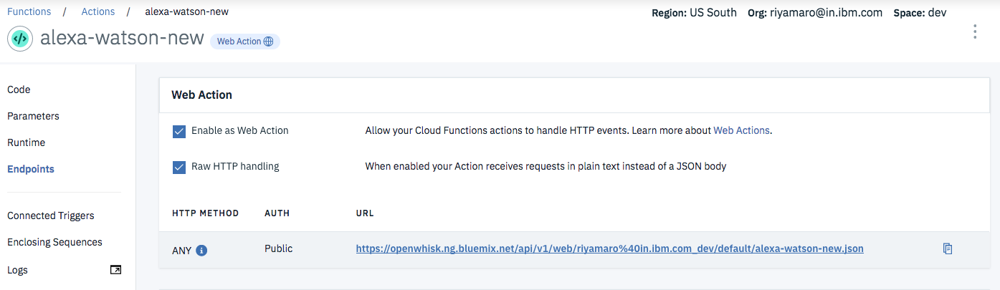
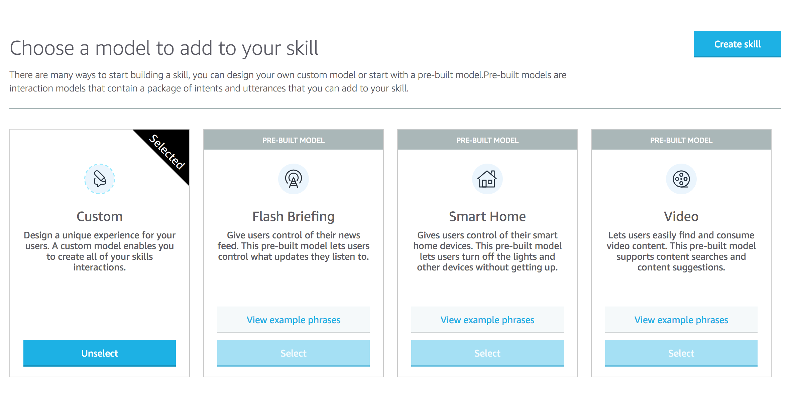
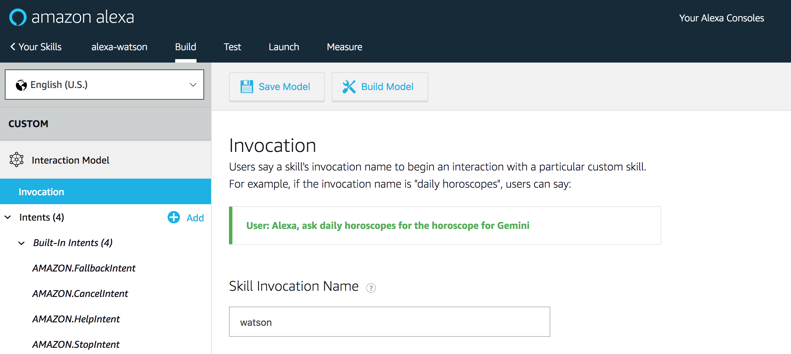
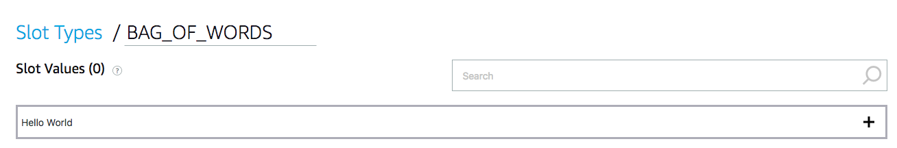
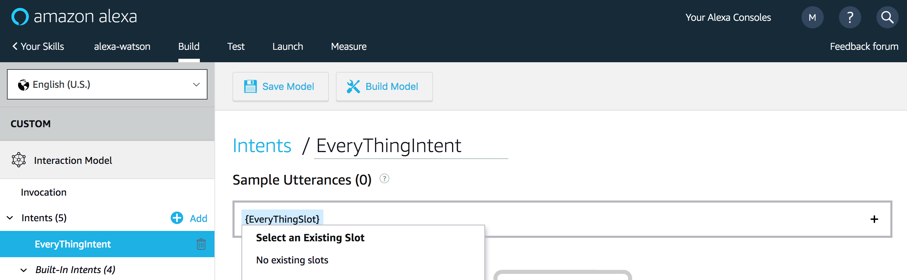
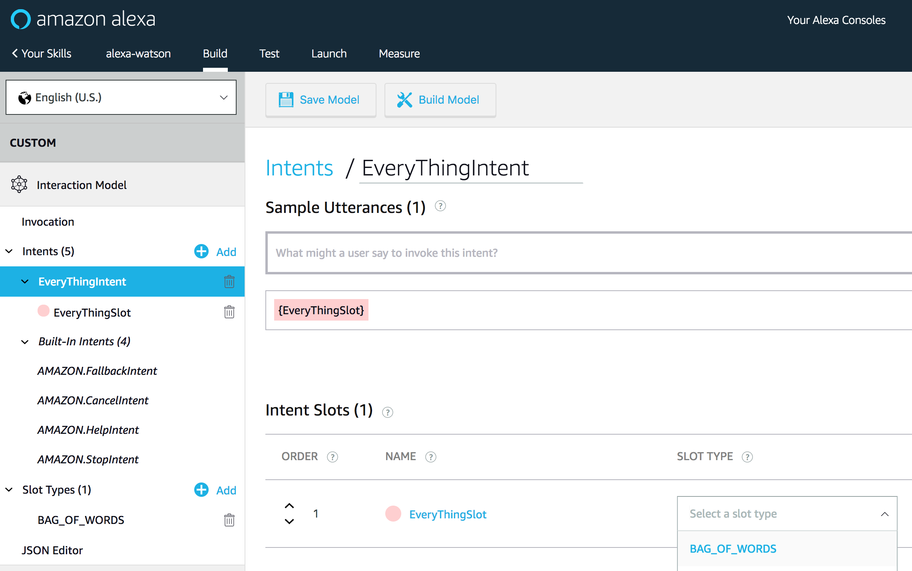
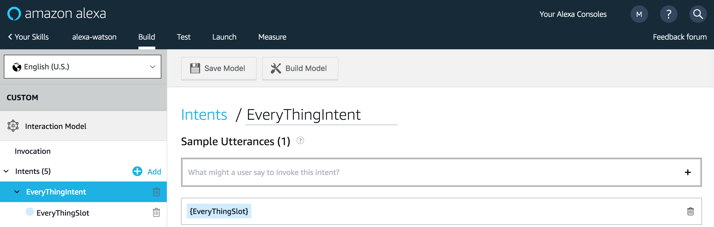
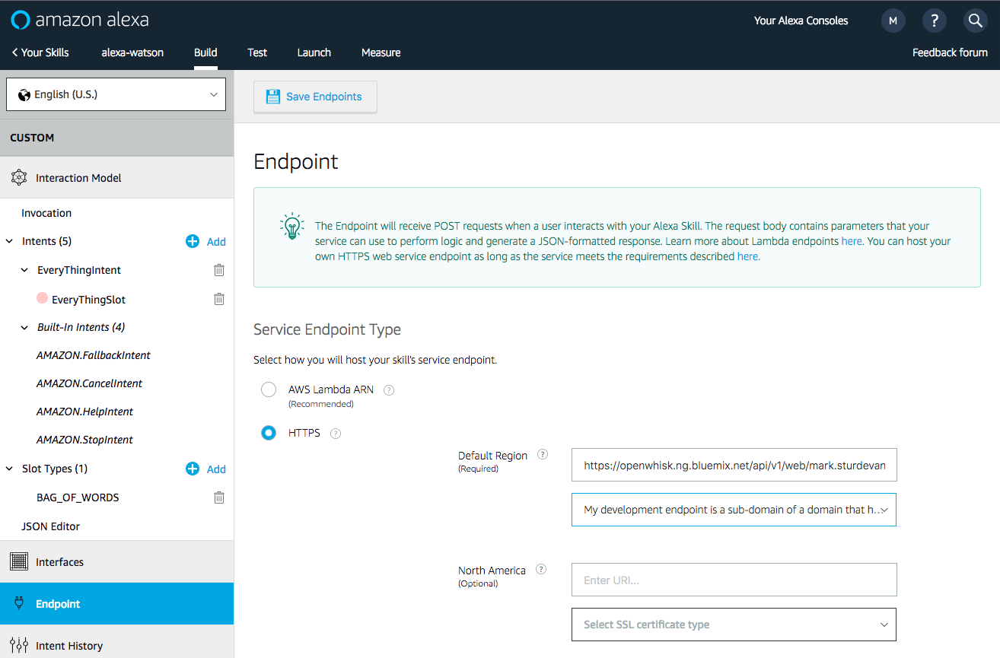
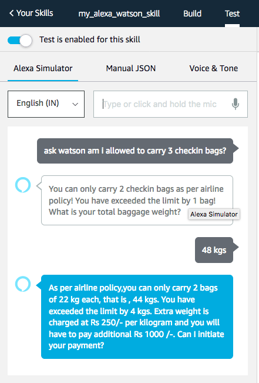

# Create an Alexa skill using Watson Assistant and Serverless

In this Code Pattern, we will create an Alexa skill using [Watson Assistant](https://www.ibm.com/watson/developercloud/conversation.html) via the IBM Cloud Functions serverless framework.

Alexa is the voice service behind products like the Amazon Echo.

IBM Cloud Functions (based on Apache OpenWhisk) will be used to integrate Alexa with Watson Assistant.

# Pre-requisites

[IBM Cloud Account](https://ibm.biz/BdYEQU)

[IBM Cloud CLI](https://console.bluemix.net/docs/cli/reference/bluemix_cli/download_cli.html#install_use)

[Amazon Developer Console](https://developer.amazon.com/)

# Steps

## Run locally

1. Clone the repo
2. Create a Watson Assistant workspace
3. Configure credentials
4. Create an action in IBM Cloud Functions
5. Create an Alexa skill
6. Talk to it

### 1. Clone the repo

Clone the `alexa-serverless-watson` repo locally and `cd` to the local repo
(for commands in later steps). In a terminal, run:

```
$ git clone https://github.com/RiyaMRoy04/alexa-serverless-watson.git
$ cd alexa-skill-serverless-watson
```

### 2. Create a Watson Assistant workspace

Sign up for [IBM Cloud](https://ibm.biz/BdZ7QU) if you don't have an IBM Cloud account yet.

Create Watson Assistant service from the Catalog in IBM Cloud:
* [**Watson Assistant**](https://console.ng.bluemix.net/catalog/services/conversation)

Import the watson_assistant_workspace.json:
* Find the Assistant service in your IBM Cloud Dashboard.
* Click on the service and then click on `Launch Tool`.
* Go to the `Workspaces` tab.
* Click on the **import** icon (next to the Workspaces Create button).
* Click `Choose a file`, go to your cloned repo dir, and `Open` the watson_assistant_workspace.json file in [`data/watson_assistant_workspace.json`](data/watson_assistant_workspace.json).
* Select `Everything` and click `Import`.

### 3. Configure credentials

The default runtime parameters need to be set for the action.
These can be set on the command-line or via the IBM Cloud UI.
Here we've provided a params.sample file for you to copy and use
with the `-param-file .params` option (which is used in the instructions below).

Copy the [`params.sample`](params.sample) to `.params`.

```
$ cp params.sample .params
```
Edit the `.params` file and add the required settings.

#### `params.sample:`

```json
{
  "CONVERSATION_USERNAME": "<add_assistant_username>",
  "CONVERSATION_PASSWORD": "<add_assistant_password>",
  "WORKSPACE_ID": "<add_assistant_workspace_id>"
}
```
### 4. Create the IBM Cloud Functions action

Run the following to [install the OpenWhisk bindings for IBM Cloud](https://console.bluemix.net/openwhisk/learn/cli):
```
bx plugin install Cloud-Functions -r Bluemix
```

Use `bx login` to initially login or to change your target:
```
bx login -a <API endpoint> -o <Organization> -s <Space>
```

Run the following command to update your OpenWhisk bindings if they are already installed:
```
bx wsk package refresh
```

Run the following to test OpenWhisk on IBM Cloud:
```
bx wsk action invoke /whisk.system/utils/echo -p message hello --result
```

#### Create an action in IBM Cloud Functions
Run these commands within your cloned repo to gather Node.js requirements, zip the source files, and upload the zipped files
to create a raw HTTP web action in OpenWhisk.

> Note: You can use the same commands to update the action if you modify the code or the .params.

```sh
npm install
rm action.zip
zip -r action.zip main.js package* node_modules
bx wsk action update alexa-watson-new action.zip --kind nodejs:6 --web raw --param-file .params
```

#### Determine your IBM Cloud endpoint:

To find this URL, navigate to [IBM Cloud Functions - Actions](https://console.bluemix.net/openwhisk/manage/actions), click on your
`alexa-watson-new` action and use the sidebar to navigate to `Endpoints`.  The Web Action URL ends with `.json`.



### 5. Create an Alexa skill

Sign up for an Amazon Developer Portal account [here](http://developer.amazon.com/).

Go to https://developer.amazon.com/alexa/console/ask and click the `Create Skill` button.


Provide a name and hit `Next`.

Use the `Select` button to create a **Custom** skill and hit the `Create Skill` button.



Provide an invocation name:



Add a custom slot type:

* In the left sidebar menu, click on `Slot Types (#)` and hit `+ Add`.


* Use the name `BAG_OF_WORDS` and hit the `Create custom slot type` button.


* Now `BAG_OF_WORDS` needs a slot value. Just enter `Hello World` and hit the plus sign so that it has a slot value.



Add a custom intent type:

* In the left sidebar menu, click on `Intents (#)` and hit `+ Add`.


* Use the name `EveryThingIntent` and hit the `Create custom intent` button.
* Add `{EveryThingSlot}` under Sample Utterances. Use the plus sign to create the `EveryThingSlot`.



* Scroll down to `Intent Slots (#)`
* Use the `Select a slot type` pulldown to give `EveryThingSlot` the slot type `BAG_OF_WORDS`.



Click on `Save Model` and then `Build Model`.



Configure the endpoint:

* Click on `Endpoint` in the right-hand sidebar.
* Select `HTTPS` as the Service Endpoint Type.
* For the Default Region enter the **HTTPS** service endpoint which is the URL of your IBM Cloud Functions **Web Action** from step 4.
* Use the pull-down to select `My development endpoint is a sub-domain of a domain that has a wildcard certificate from a certificate authority`.
* Click the `Save Endpoints` button and **BUILD THE MODEL**!



### 6. Talk to it

Use the `Test` tab in the Amazon developer console.

Use the slider to enable your skill for testing. You can type or talk and test the skill in the test UI.

You can invite others to test it with the beta test feature. In order to be eligible for beta test, you must fill out most of the publishing information.

You probably shouldn't publish this example, but you are now ready to create and publish your own Alexa skill.

### Sample Output



## Watson Assistant Documentation

[Watson Assistant Docs](https://console.bluemix.net/docs/services/conversation/getting-started.html#gettingstarted)

# Learn more

* **Artificial Intelligence Code Patterns**: Enjoyed this Code Pattern? Check out our other [AI Code Patterns](https://developer.ibm.com/code/technologies/artificial-intelligence/).
* **AI and Data Code Pattern Playlist**: Bookmark our [playlist](https://www.youtube.com/playlist?list=PLzUbsvIyrNfknNewObx5N7uGZ5FKH0Fde) with all of our Code Pattern videos
* **With Watson**: Want to take your Watson app to the next level? Looking to utilize Watson Brand assets? [Join the With Watson program](https://www.ibm.com/watson/with-watson/) to leverage exclusive brand, marketing, and tech resources to amplify and accelerate your Watson embedded commercial solution.

** This repository is a fork of [https://github.com/IBM/alexa-skill-watson-conversation](https://github.com/IBM/alexa-skill-watson-conversation) with certain updates (You can leverage this code pattern if you are interested in Building Alexa skill with Redis database and Weather Channel data) **
